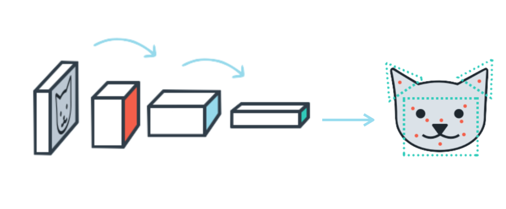

# Facial Keypoint Detection

## Project Overview


In this project, we’ll combine knowledge of computer vision techniques and deep learning architectures to build a facial keypoint detection system. Facial keypoints include points around the eyes, nose, and mouth on a face and are used in many applications. These applications include: facial tracking, facial pose recognition, facial filters, and emotion recognition. Completed code should be able to look at any image, detect faces, and predict the locations of facial keypoints on each face; examples of these keypoints are displayed below.


## Final Model
```python
class Net(nn.Module):

    def __init__(self):
        super(Net, self).__init__()

        self.conv1 = nn.Conv2d(1, 32, 5)
        self.conv2 = nn.Conv2d(32, 64, 3)
        self.conv3 = nn.Conv2d(64, 128, 3)
        
        # batch normalization layers
        self.b_norm1 = nn.BatchNorm2d(32)
        self.b_norm2 = nn.BatchNorm2d(64)
        self.b_norm3 = nn.BatchNorm2d(128)
        
        # pooling layer
        self.maxpool = nn.MaxPool2d(2)
        
        # dropout layers
        self.dropout1 = nn.Dropout(p=0.4)
        self.dropout2 = nn.Dropout(p=0.2)
        
        # fully connected layers
        self.fc1 = nn.Linear(128*26*26, 1024)
        self.fc2 = nn.Linear(1024, 512)
        self.fc3 = nn.Linear(512, 136)
 

    def forward(self, x):
        # as relu(maxpool) == maxpool(relu), use relu(maxpool) for better computation speed
        x = F.relu(self.maxpool(self.b_norm1(self.conv1(x))))
        x = F.relu(self.maxpool(self.b_norm2(self.conv2(x))))
        x = F.relu(self.maxpool(self.b_norm3(self.conv3(x))))

        x = x.view(x.size(0), -1)
        x = self.dropout1(F.relu(self.fc1(x)))
        x = self.dropout2(F.relu(self.fc2(x)))
        x = self.fc3(x)

        return x
```

## Sample Output


_Image credits: [Udacity](https://www.udacity.com)_
