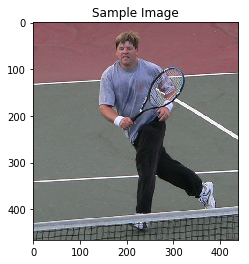
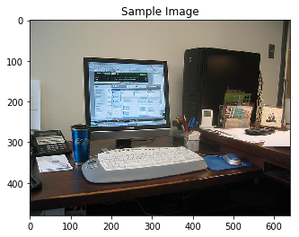
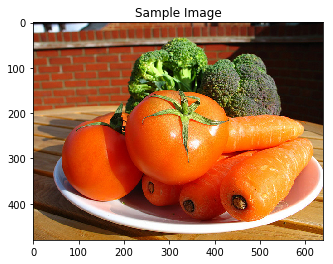

# Image Captioning
In this project, I design and train a **ENCODER-DECODER** (Convolutional Neural Network - Recurrent Neural Network) model for automatically generating image captions. The network is trained on the Microsoft Common Objects in COntext [(MS COCO)](https://cocodataset.org/#home) dataset. The image captioning model is displayed below.

_Image credits: [Udacity](https://www.udacity.com)_

## Predictions

`A man is playing tennis on a tennis court.`
##

`A desk with a computer and a keyboard.`
##

`A bowl of fruit including oranges and bananas.`
