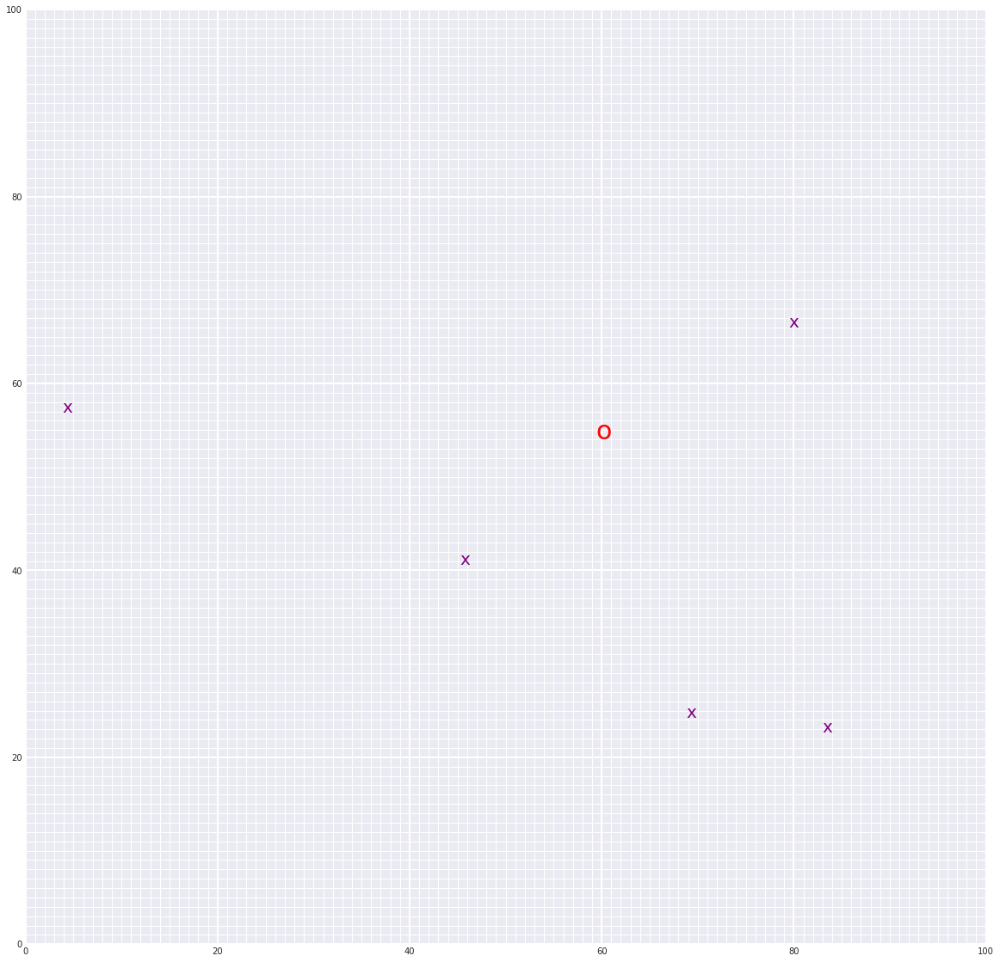

# Landmark Detection and Tracking (SLAM)

## Project Overview
In this project, you'll implement SLAM (Simultaneous Localization and Mapping) for a 2 dimensional world! You’ll combine what you know about robot sensor measurements and movement to create a map of an environment from only sensor and motion data gathered by a robot, over time. SLAM gives you a way to track the location of a robot in the world in real-time and identify the locations of landmarks such as buildings, trees, rocks, and other world features. This is an active area of research in the fields of robotics and autonomous systems.

Below is an example of a 2D robot world with landmarks (purple x's) and the robot (a red 'o') located and found using only sensor and motion data collected by that robot. This is just one example for a 50x50 grid world; in your work you will likely generate a variety of these maps.

## Estimate
### Robot
>**True Position**: `[58.49491, 56.84132]`

>**Estimate**: `[60.22154, 54.85615]`

### Landmarks
>**True Position**: `[[79, 67], [69, 25], [5, 57], [83, 23], [46, 41]]`

>**Estimate**: `[[80.014, 66.530], [69.308, 24.763], [4.354, 57.431], [83.497, 23.186], [45.727, 41.104]]`
