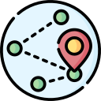

# Udacity Computer Vision Nanodegree
Projects completed under [Udacity's Computer Vision nanodegree](https://www.udacity.com/course/computer-vision-nanodegree--nd891) program.

[PyTorch](https://pytorch.org/) library is used to complete the projects 1 and 2.
## Project-1: [Facial Keypoint Detection](https://github.com/cloud-VG/Udacity-Computer-Vision-Nanodegree/tree/master/Facial%20Keypoint%20Detection)

In this project, we'll build a Facial keypoint detection system. The system consists of a face detector that uses Haar cascades and a Convolutional Neural Network, that predicts the keypoints on the detected face.

_Original Repo: [Link](https://github.com/udacity/P1_Facial_Keypoints_)
## Project-2: [Image Captioning](https://github.com/cloud-VG/Udacity-Computer-Vision-Nanodegree/tree/master/Image%20Captioning)

In this project, we'll design and train a ENCODER-DECODER(Convolutional Neural Network - Recurrent Neural Network) model for automatically generating image captions. The network is trained on the Microsoft Common Objects in COntext [(MS COCO)](https://cocodataset.org/#home) dataset.

_Original Repo: [Link](https://github.com/udacity/CVND---Image-Captioning-Project)_
## Project-3: [Landmark Detection and Tracking (SLAM)](https://github.com/cloud-VG/Udacity-Computer-Vision-Nanodegree/tree/master/Landmark%20Detection%20and%20Tracking%20(SLAM))

In this project, we'll implement SLAM (Simultaneous Localization and Mapping) for a 2-dimensional world. Sensor and motion data gathered by a simulated robot is used to create a map of an environment. SLAM gives us a way to track the location of a robot in the world in real-time and identify the locations of landmarks such as buildings, trees, rocks, etc.

_Original Repo: [Link](https://github.com/udacity/CVND_Localization_Exercises/tree/master/Project_Landmark%20Detection)_

_Images credits: [Flaticon](https://www.flaticon.com/)_
